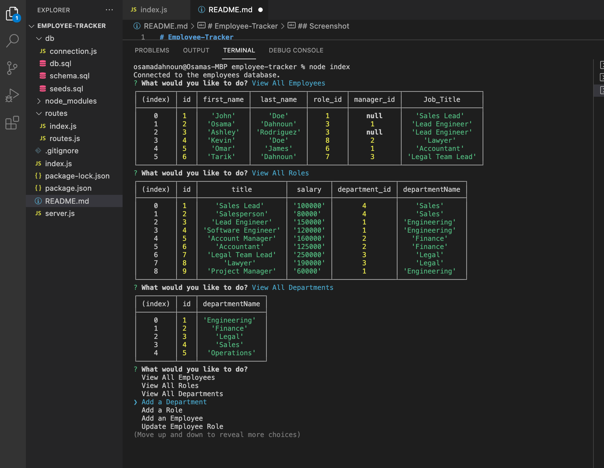

# Employee-Tracker

## Description
* Employee Tracker is a Web Application that allows a user to create, read, and update departments, employees, and roles in an employee database.

## Built With
* Node.js
* MySQL
* Inquirer
* Express.js

## Screenshot

## Link to Walkthrough Video
[Walkthrough Application](https://watch.screencastify.com/v/gexYikrax2Sy04EBCMbw)

## Contribution
Employee-Tracker ❤️ Made With Love by Osama Dahnoun